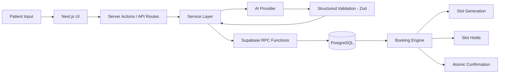
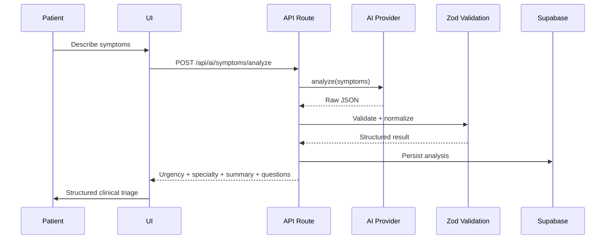
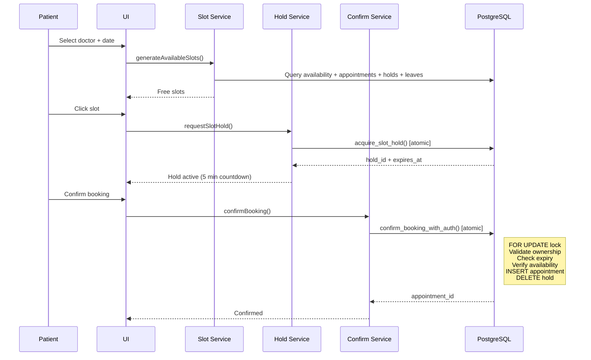

# CareFlow AI

AI-powered healthcare appointment and clinical intelligence platform.

---

## What This Is

CareFlow AI is a full-stack application that combines AI-assisted symptom analysis with a concurrency-safe appointment booking engine. Patients describe symptoms in natural language, receive structured clinical triage from an AI provider, and book appointments with matching specialists — all with database-level race condition protection.

---

## Problem

Healthcare appointment systems suffer from three gaps:

1. **Triage is manual.** Patients don't know which specialist to see, leading to wrong-department visits and wasted slots.
2. **Booking is fragile.** Concurrent users can double-book the same slot, and most systems have no atomic booking confirmation.
3. **AI output is unvalidated.** LLM responses are presented raw without schema enforcement, creating risk of malformed medical information.

CareFlow AI addresses all three with a validated AI pipeline, a PostgreSQL-enforced booking engine, and structured output schemas.

---

## Core Differentiators

- **Database-level concurrency protection** — Race conditions prevented by PostgreSQL `FOR UPDATE` locks and constraint triggers, not application code
- **Validated AI pipeline** — Every LLM response passes Zod schema validation before reaching the client; invalid output triggers controlled fallback
- **Provider abstraction** — Swappable AI providers (mock, OpenAI, Gemini) with zero changes to validation or persistence layers
- **Atomic booking confirmation** — Hold → verify → confirm → delete happens in a single PostgreSQL transaction
- **Cancel-after-confirm rescheduling** — Old appointment only cancelled after new booking succeeds, preventing patient slot loss

---

## Implemented Features

| Feature | Status | Description |
|---------|--------|-------------|
| AI Symptom Analysis | ✅ | Natural language → structured triage (urgency, specialty, summary, questions) |
| AI Provider Abstraction | ✅ | Mock + OpenAI + Gemini providers with env-based selection |
| AI Output Validation | ✅ | Zod schemas normalize and validate all AI output |
| AI Analysis Persistence | ✅ | Validated analyses saved to Supabase `ai_analyses` |
| Doctor Matching | ✅ | AI analysis → ranked specialist matching with availability |
| Dynamic Slot Generation | ✅ | Real-time available slots from doctor availability + exclusions |
| Temporary Slot Holds | ✅ | 5-minute atomic holds via PostgreSQL RPC |
| Transactional Booking | ✅ | Atomic confirmation with ownership + expiry + overlap checks |
| Appointment Cancellation | ✅ | Patient-authorized with ownership verification |
| Appointment Rescheduling | ✅ | Cancel-after-confirm pattern using existing booking engine |
| Overlap Prevention Trigger | ✅ | Database trigger rejects overlapping INSERT/UPDATE |
| Concurrency Test Suite | ✅ | 13 automated tests including race condition verification |
| Multi-Role Dashboards | ✅ | Patient, Doctor, Admin views |
| Doctor Discovery | ✅ | Browse doctors with specialty, experience, availability |
| Care Timeline | ✅ | Chronological care event history |
| Bilingual UI | ✅ | English/Hindi interface labels |
| Development Logging | ✅ | Structured `[DataAdapter]` + `[AIAnalysis]` terminal output |
| Mock Fallback | ✅ | Full offline functionality when Supabase is unavailable |

---

## Architecture



### AI Pipeline



### Booking Engine



See [docs/ARCHITECTURE.md](docs/ARCHITECTURE.md) for complete architecture documentation including database schema, concurrency protection details, and rescheduling flows.

---

## Technology Stack

| Layer | Technology |
|-------|-----------|
| Framework | Next.js 16 (App Router) |
| UI | React 19 + Tailwind CSS 4 |
| Language | TypeScript 5 |
| Database | Supabase (PostgreSQL) |
| Validation | Zod 4 |
| AI Provider | OpenAI SDK 7 + Google GenAI SDK 2 (mock by default) |
| Testing | Vitest 4 |
| Icons | Lucide React |

---

## Getting Started

### Prerequisites

- Node.js 18+
- A Supabase project (free tier works)

### Setup

```bash
# Clone and install
cd careflow-ai
npm install

# Configure environment
cp .env.example .env.local
# Edit .env.local with your Supabase credentials

# Run database migrations (in Supabase SQL Editor)
# 1. supabase/migrations/001_initial_schema.sql
# 2. supabase/migrations/002_fix_handle_new_user_trigger.sql
# 3. supabase/migrations/003_backfill_profiles_and_fix_trigger.sql
# 4. supabase/migrations/004_booking_concurrency_protection.sql
# 5. supabase/migrations/005_booking_confirmation.sql
# 6. supabase/migrations/006_cancellation_rescheduling.sql

# Seed demo data
# Run supabase/seed_demo.sql in Supabase SQL Editor
# (requires 3 auth users: see supabase/SEED_INSTRUCTIONS.md)

# Start development server
npm run dev
```

Open **http://localhost:3000**.

---

## Environment Variables

| Variable | Required | Default | Description |
|----------|----------|---------|-------------|
| `NEXT_PUBLIC_SUPABASE_URL` | **Yes** | — | Supabase project URL |
| `NEXT_PUBLIC_SUPABASE_ANON_KEY` | **Yes** | — | Supabase anonymous key |
| `SUPABASE_SERVICE_ROLE_KEY` | **Yes** | — | Supabase service role key (server only) |
| `AI_PROVIDER` | No | auto | `mock`, `openai`, or `gemini` |
| `OPENAI_API_KEY` | No | — | Required for OpenAI provider |
| `OPENAI_MODEL` | No | `gpt-4o-mini` | OpenAI model to use |
| `GEMINI_API_KEY` | No | — | Required for Gemini provider |
| `GEMINI_MODEL` | No | `gemini-3.6-flash` | Gemini model to use |

See [`.env.example`](.env.example) for a template.

---

## Database

### Running Migrations

Execute each migration file in order in the Supabase SQL Editor:

1. `001_initial_schema.sql` — Core tables (profiles, patients, doctors, appointments, availability, slot_holds, leaves, notifications, ai_analyses)
2. `002_fix_handle_new_user_trigger.sql` — Auth trigger fix
3. `003_backfill_profiles_and_fix_trigger.sql` — Profile backfill
4. `004_booking_concurrency_protection.sql` — DB functions + indexes for concurrency
5. `005_booking_confirmation.sql` — Auth confirmation + overlap trigger
6. `006_cancellation_rescheduling.sql` — Cancel + reschedule RPCs

### Key PostgreSQL Functions

| Function | Purpose |
|----------|---------|
| `acquire_slot_hold()` | Atomic 5-minute slot reservation |
| `confirm_booking_with_auth()` | Transactional hold → appointment conversion |
| `cancel_appointment_with_auth()` | Ownership-verified cancellation |
| `prevent_overlapping_appointments()` | Trigger: reject overlapping bookings |
| `cleanup_expired_holds()` | Remove expired slot holds |

---

## AI Provider

By default, CareFlow AI uses a **mock provider** that requires no API key. The mock routes symptoms to pre-built responses via keyword matching.

To use a real LLM:

```bash
# Option A: OpenAI
AI_PROVIDER=openai
OPENAI_API_KEY=sk-your-key-here

# Option B: Google Gemini
AI_PROVIDER=gemini
GEMINI_API_KEY=your-gemini-key-here
```

The provider is selected at startup by `lib/ai/provider-factory.ts`. All output passes through Zod validation regardless of provider.

See [docs/ARCHITECTURE.md](docs/ARCHITECTURE.md) for provider architecture details.

---

## Testing

```bash
# Run all tests
npm test

# Run in watch mode
npm run test:watch

# Type check
npx tsc --noEmit

# Lint
npm run lint

# Production build
npm run build
```

### Automated Concurrency Tests

Navigate to `/dev/slots-verification` in development mode to run 13 automated tests covering slot generation, holds, confirmation, cancellation, and race conditions.

---

## Demo Routes

| Route | Description |
|-------|-------------|
| `/` | Landing page |
| `/patient` | Patient dashboard |
| `/patient/symptoms` | AI symptom check |
| `/patient/booking` | Appointment booking |
| `/patient/doctors` | Doctor discovery |
| `/patient/appointments` | Appointment list |
| `/patient/timeline` | Care timeline |
| `/doctor` | Doctor dashboard |
| `/admin` | Admin dashboard |
| `/admin/doctors` | Doctor management |
| `/admin/appointments` | Appointment management |
| `/admin/leaves` | Leave management |
| `/dev/slots-verification` | Booking engine test suite |

---

## Documentation

- [Architecture](docs/ARCHITECTURE.md) — System design, database schema, concurrency model, Mermaid diagrams
- [Evaluation Guide](docs/EVALUATION_GUIDE.md) — Step-by-step walkthrough for evaluators

---

## Healthcare Disclaimer

CareFlow AI is a **demonstration platform** for evaluating AI-assisted healthcare workflows. It is not a medical device and does not provide medical advice.

- AI analysis is a **triage indicator only**, not a diagnosis
- All AI output includes a medical disclaimer
- HIGH urgency results include safety recommendations
- Clinical decisions must be made by licensed healthcare providers
- This system does not store or process PHI in compliance with HIPAA

---

## Future Roadmap

- Real Supabase Auth integration (login/signup/logout)
- Per-doctor timezone support for slot generation
- pg_cron-based expired hold cleanup
- Push notifications for appointment reminders
- Doctor-side appointment cancellation flow
- Hindi language AI analysis output
- Patient analysis history view
- Voice input for symptom description
- Multi-provider concurrent fallback
- Multi-doctor demo seed data

---

## License

See [LICENSE](../LICENSE).
