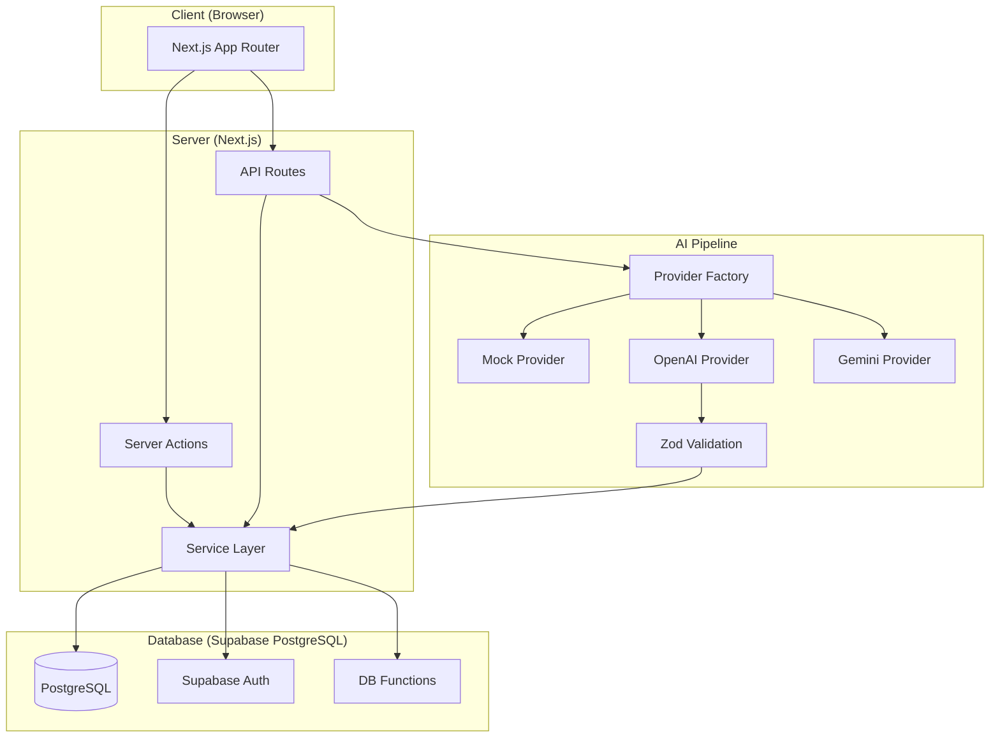
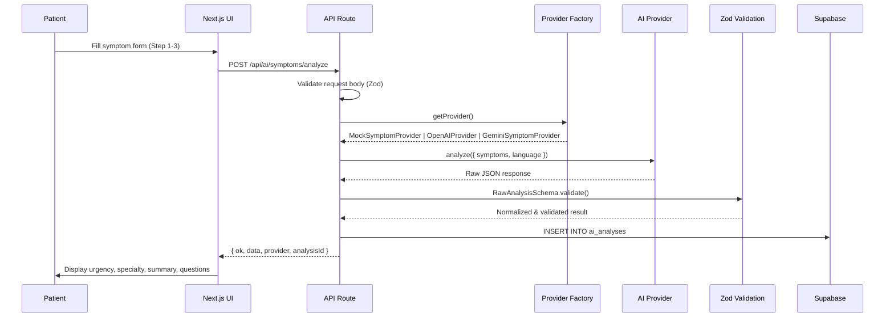
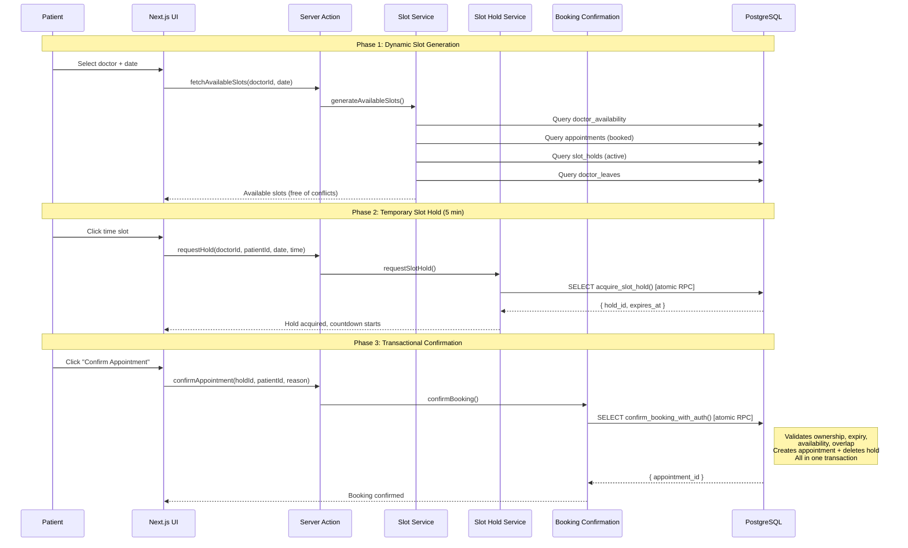
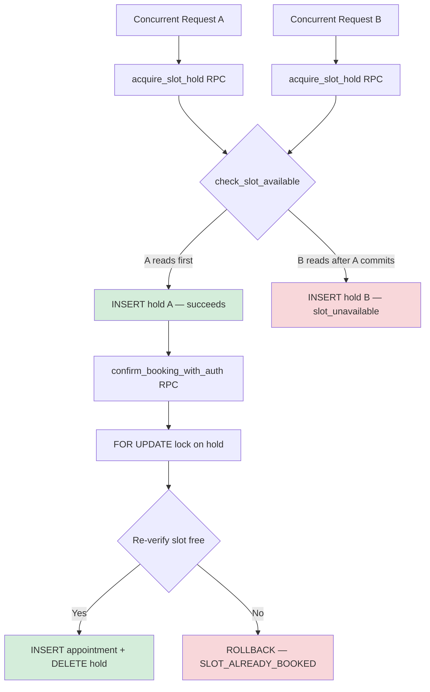
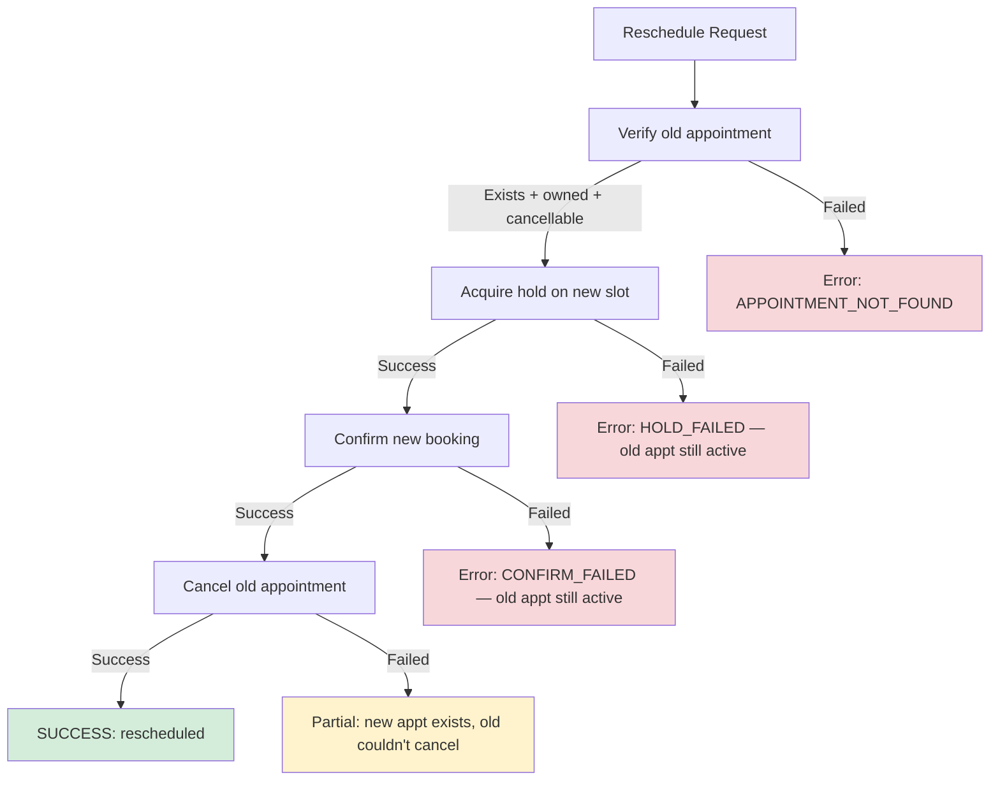
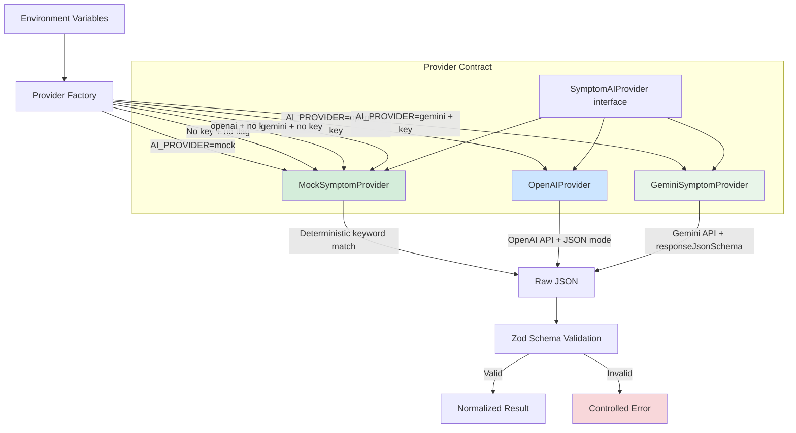
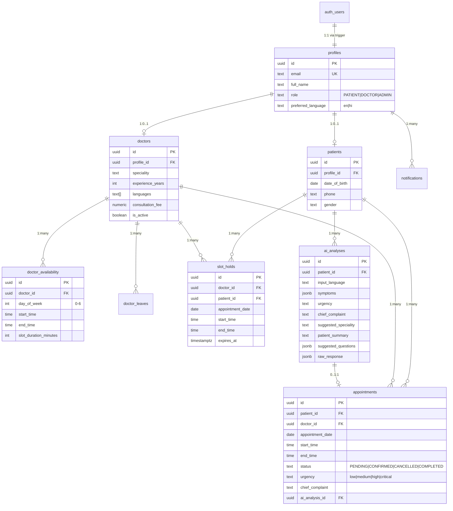

# CareFlow AI — Architecture

## Overview

CareFlow AI is a full-stack healthcare appointment and clinical intelligence platform built with Next.js 16 and Supabase. The system provides AI-assisted symptom analysis, concurrency-safe appointment booking, and multi-role dashboards for patients, doctors, and administrators.

---

## High-Level Architecture



---

## AI Symptom Analysis Pipeline

The AI pipeline follows a provider abstraction pattern. A factory selects the active provider based on environment variables. All provider output is validated through Zod schemas before persistence or client delivery.



---

## Appointment Booking Architecture

The booking engine uses a three-phase approach: dynamic slot generation, temporary slot holds, and atomic confirmation. All concurrency protection is enforced at the database level through PostgreSQL functions.



---

## Database-Level Concurrency Protection

Concurrency is enforced through PostgreSQL functions and triggers, not application code. This prevents race conditions even under simultaneous requests.



### Protection Layers

| Layer | Mechanism | Protects Against |
|-------|-----------|-----------------|
| **Slot generation** | Excludes booked + held + leave intervals | Displaying unavailable slots |
| **Slot hold** | `acquire_slot_hold()` atomic RPC | Two patients holding the same slot |
| **Booking confirmation** | `confirm_booking_with_auth()` with `FOR UPDATE` lock | Confirming an expired/owned/concurrent hold |
| **Overlap trigger** | `prevent_overlapping_appointments` constraint trigger | Two appointments for same doctor/time |
| **Cancellation** | `cancel_appointment_with_auth()` with ownership check | Unauthorized cancellation |

---

## Rescheduling Transaction Flow

Rescheduling follows a **cancel-after-confirm** pattern. The old appointment is only cancelled after the new booking is confirmed, preventing the patient from losing their slot if the new booking fails.



---

## Supabase Integration

### Client Types

| Client | Usage | File |
|--------|-------|------|
| Server client | Server components, server actions, API routes | `lib/supabase/server.ts` |
| Browser client | Client components (currently unused — all data via server) | `lib/supabase/client.ts` |
| Admin client | Service role operations (bypasses RLS) | `lib/supabase/admin.ts` |

### Data Adapter Pattern

The service layer (`lib/services/index.ts`) implements a data adapter pattern:

```
Supabase configured?  →  Query real database
Not configured?       →  Return mock data from lib/mock-data.ts
Query fails?          →  Log error, fall back to mock data
```

This allows the application to function fully without a database connection during development.

---

## AI Provider Architecture



### Mock Provider Keyword Routing

| Input Keywords | Specialty | Urgency |
|---------------|-----------|---------|
| headache, head pain, migraine | Neurology | MEDIUM |
| chest pain, chest tightness, heart pain | Cardiology | **HIGH** |
| fever, high temperature, chills | Internal Medicine | MEDIUM |
| cough, coughing, chest congestion | Pulmonology | MEDIUM |
| stomach pain, abdominal pain, nausea, diarrhea | Gastroenterology | MEDIUM |
| *(no match)* | General Practice | MEDIUM |

---

## Database Schema

### Entity Relationship



---

## Technology Stack

| Layer | Technology | Version |
|-------|-----------|---------|
| Framework | Next.js (App Router) | 16.3.2 |
| UI | React | 19.2.8 |
| Styling | Tailwind CSS | 4.x |
| Language | TypeScript | 5.x |
| Database | Supabase (PostgreSQL) | — |
| Auth | Supabase Auth | — |
| Validation | Zod | 4.4.3 |
| AI Provider | OpenAI SDK + Google GenAI SDK | 7.5.0 + 2.18.0 |
| Icons | Lucide React | 1.33.0 |
| Testing | Vitest | 4.1.11 |

---

## Project Structure

```
careflow-ai/
├── app/
│   ├── api/
│   │   └── ai/
│   │       ├── doctors/match/route.ts     # POST: AI-assisted doctor matching
│   │       └── symptoms/analyze/route.ts  # POST: Symptom analysis
│   ├── dev/
│   │   └── slots-verification/page.tsx    # Dev-only booking engine tests
│   ├── patient/
│   │   ├── booking/                       # Appointment booking flow
│   │   ├── doctors/                       # Doctor discovery
│   │   ├── symptoms/                      # AI symptom check
│   │   ├── appointments/                  # Appointment list + detail
│   │   └── timeline/                      # Care timeline
│   ├── doctor/
│   │   ├── appointments/                  # Doctor appointment view
│   │   ├── consultation/[id]/             # Consultation detail
│   │   └── patients/                      # Patient list
│   └── admin/
│       ├── doctors/                       # Doctor management
│       ├── appointments/                  # All appointments
│       └── leaves/                        # Leave management
├── lib/
│   ├── ai/
│   │   ├── provider.ts                    # SymptomAIProvider interface
│   │   ├── mock-provider.ts               # Deterministic mock provider
│   │   ├── openai-provider.ts             # OpenAI provider
│   │   ├── gemini-provider.ts             # Google Gemini provider
│   │   ├── provider-factory.ts            # Env-based provider selection
│   │   ├── schema.ts                      # Zod schemas + prompts
│   │   ├── types.ts                       # AI analysis types
│   │   ├── validate.ts                    # Validation + fallback
│   │   └── __tests__/                     # AI route tests
│   ├── services/
│   │   ├── availability.ts                # Slot generation engine
│   │   ├── availability-helpers.ts        # Pure time/interval helpers
│   │   ├── slot-holds.ts                  # Temporary slot holds
│   │   ├── booking-confirmation.ts        # Atomic booking confirmation
│   │   ├── appointment-management.ts      # Cancel + reschedule
│   │   ├── ai-analysis.ts                 # AI analysis persistence
│   │   ├── doctors.ts                     # Doctor queries
│   │   ├── appointments.ts                # Appointment queries
│   │   ├── leaves.ts                      # Leave queries
│   │   ├── index.ts                       # Data adapter (Supabase/mock)
│   │   ├── logger.ts                      # Dev-only structured logging
│   │   └── __tests__/                     # Service tests
│   ├── actions/
│   │   ├── slots.ts                       # Server actions for booking
│   │   ├── bookings.ts                    # Server actions for confirmation
│   │   └── appointments.ts                # Server actions for management
│   ├── supabase/
│   │   ├── server.ts                      # Server-side Supabase client
│   │   ├── client.ts                      # Browser Supabase client
│   │   ├── admin.ts                       # Service role client
│   │   └── types.ts                       # Generated DB types
│   ├── config/
│   │   └── demo-identity.ts               # Development demo accounts
│   ├── types.ts                           # Frontend domain types
│   ├── mock-data.ts                       # Mock data for offline dev
│   ├── navigation.ts                      # Role-based navigation
│   ├── translations.ts                    # i18n strings (en/hi)
│   └── LanguageContext.tsx                 # Client language state
├── components/
│   ├── app/                               # App-specific components
│   └── ui/                                # Shared UI primitives
├── supabase/
│   ├── migrations/
│   │   ├── 001_initial_schema.sql         # Core schema + triggers
│   │   ├── 002_fix_handle_new_user_trigger.sql
│   │   ├── 003_backfill_profiles_and_fix_trigger.sql
│   │   ├── 004_booking_concurrency_protection.sql  # DB functions + indexes
│   │   ├── 005_booking_confirmation.sql            # Auth confirmation + overlap trigger
│   │   └── 006_cancellation_rescheduling.sql       # Cancel + reschedule RPCs
│   ├── seed.sql                           # Base seed data
│   └── seed_demo.sql                      # Demo account data
└── docs/
    ├── ARCHITECTURE.md                    # This document
    └── EVALUATION_GUIDE.md               # Evaluator walkthrough
```

---

## PostgreSQL Functions Reference

| Function | Purpose | Called From |
|----------|---------|------------|
| `acquire_slot_hold()` | Atomically reserve a slot for 5 minutes | `lib/services/slot-holds.ts` |
| `confirm_booking_with_auth()` | Convert hold → confirmed appointment (with ownership + expiry checks) | `lib/services/booking-confirmation.ts` |
| `cancel_appointment_with_auth()` | Patient-authorized cancellation | `lib/services/appointment-management.ts` |
| `cancel_old_for_reschedule()` | Cancel old appointment after reschedule | `lib/services/appointment-management.ts` |
| `check_slot_available()` | Check if slot has no overlapping appointment or active hold | Slot generation |
| `check_doctor_on_leave()` | Check if doctor has approved leave on a date | Slot generation |
| `check_appointment_overlap()` | Check for overlapping confirmed/pending appointments | Overlap trigger |
| `cleanup_expired_holds()` | Delete all expired slot holds | Scheduled cleanup |
| `prevent_overlapping_appointments()` | Trigger: reject overlapping INSERT/UPDATE | Database trigger |
| `handle_new_user()` | Trigger: auto-create profile on auth signup | Database trigger |
| `update_updated_at()` | Trigger: auto-update `updated_at` column | Database trigger |

---

## Key Design Decisions

1. **Database-level concurrency, not application-level.** All race conditions are prevented by PostgreSQL functions with `FOR UPDATE` locks and constraint triggers. The application layer simply calls these functions via RPC.

2. **Mock-first development.** Every data adapter falls back to mock data when Supabase is unavailable. The AI provider defaults to mock when no API key is set. The application runs fully without any external dependencies.

3. **Cancel-after-confirm for rescheduling.** The old appointment is only cancelled after the new booking succeeds, preventing the patient from losing their slot on failure.

4. **Persistence failure does not block AI response.** If the database is unavailable when saving an AI analysis, the response is still returned to the client with `analysisId: null`. The analysis is still clinically useful.

5. **Provider abstraction.** The AI provider interface allows swapping between mock, OpenAI, Gemini, or any future provider with zero changes to the API route or validation layer.
